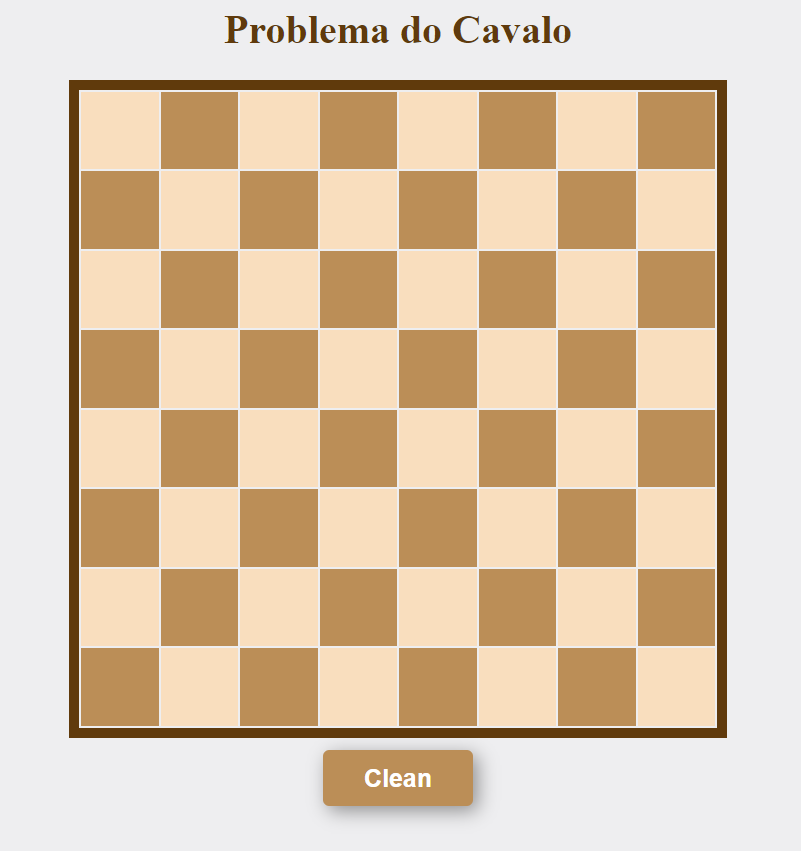
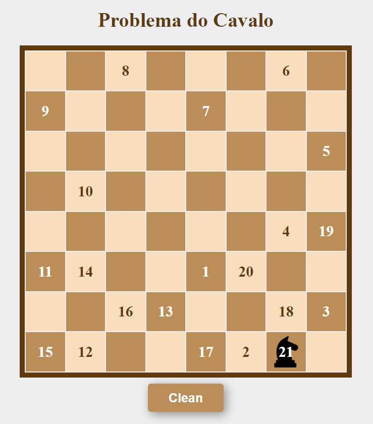

# Problema do Cavalo

- **Número da Lista**: 1
- **Conteúdo da Disciplina**: Grafos

## Alunos

|Matrícula  | Aluno |
| -- | -- |
| 211063069 | Breno Queiroz Lima |
| 140169695 | Luis Bruno Fidelis |

## Sobre 

O projeto soluciona o Problema do Cavalo utilizando o algoritmo Deep First Search(DFS).

O objetivo do Problema do Cavalo é resolver o seguinte desafio: 

Dada uma casa arbitrária em um tabuleiro de xadrez, percorra todo o tabuleiro a partir
dessa casa utilizando um cavalo, de modo que a peça não visite a mesma casa duas vezes.

O projeto está disponível pelo github pages, clique [aqui](https://projeto-de-algoritmos.github.io/Grafos1_Problema_do_Cavalo/)
para acessar.


## Screenshots





## Instalação 
- **Linguagens**: C, Javascript

Para executar em sua máquina local é necessário compilar o código C para WebAssembly utilizando
o compilador [Emscripten](https://emscripten.org/index.html) com o seguinte comando no diretório `wasm`.

``` sh
emcc -O2 knight_tour.c
```

Em seguinda abra um serviço utilizando:

```sh
emrun index.html
```

## Uso 

Basta clicar em uma casa do tabuleiro e a solução será executada.

## Outro

Aprenda o movimento do cavalo, clique [aqui](https://www.chess.com/pt-BR/terms/cavalo-xadrez)
